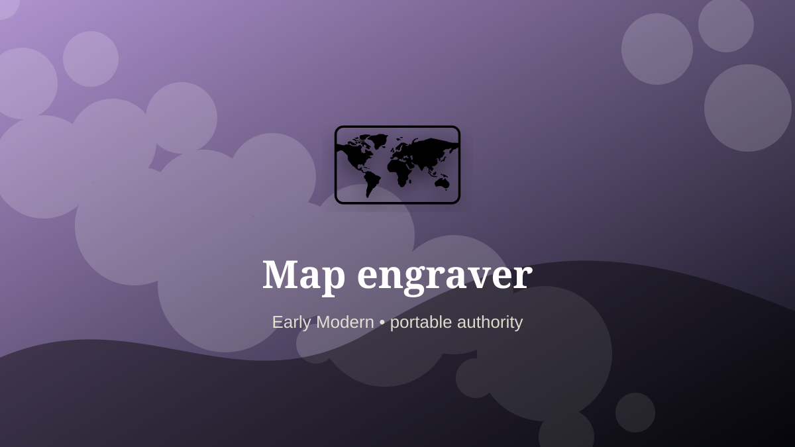

    ---
    title: "Map engraver"
    original_title: "Map engraver"
    era: "Early Modern"
    era_key: "earlymodern"
    atlas_year_reference: "atlas bridge c. 1500–1750 CE"
    type: "mainstream"
    shelf: "authority"
    evidence: "documented"
    representative_occurrence: "print centers"
    source_title: "British Museum: Vindolanda writing tablets"
    source_url: "https://www.britishmuseum.org/collection/galleries/roman-britain/vindolanda-tablets"
    image: "../assets/images/088-map-engraver.svg"
    ---

    # Map engraver

    

    **Era:** Early Modern  
    **Atlas year reference:** atlas bridge c. 1500–1750 CE  
    **Type:** mainstream  
    **Evidence status:** documented  
    **Shelf:** authority  
    **Representative occurrence:** print centers

    ## Accuracy boundary

    Historically attested role or closely attested work pattern. The wording avoids pretending every region used the same job title or routine.

    ## Rewritten card

    Map engraver sits where technique and legitimacy touch. Engraving roads, coastlines, labels, and borders onto plates turned geographic knowledge into portable infrastructure.

In the Early Modern, work like this cannot be separated cleanly from belief, law, memory, rank, or public trust. The craft mattered because it produced an outcome other people were willing to recognize as valid. Why it mattered: Maps govern movement and claims.

The strange edge is this: A scratched line can become a border. The material act was only half the job. The other half was making the act socially legible.

Representative occurrence: print centers

Modern echo: geospatial systems

Reference lead: British Museum: Vindolanda writing tablets — https://www.britishmuseum.org/collection/galleries/roman-britain/vindolanda-tablets

    ## Image guidance

    The included SVG is a local placeholder for offline viewing. For a final public atlas, replace it with a documented image where possible: museum object photo, archaeological reconstruction, historical illustration, workplace photograph, or clearly labeled concept art for speculative cards.

    ## Source lead

    - British Museum: Vindolanda writing tablets: https://www.britishmuseum.org/collection/galleries/roman-britain/vindolanda-tablets
