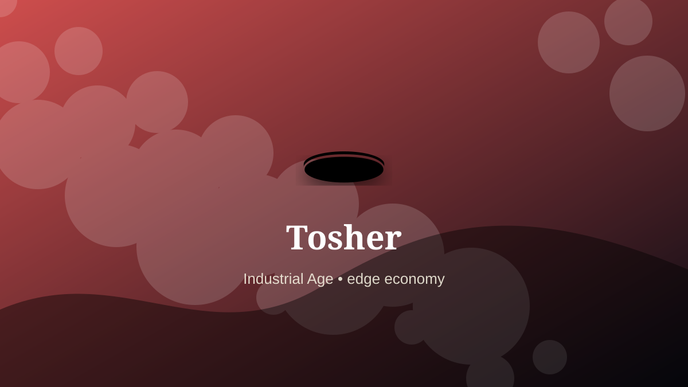

    ---
    title: "Tosher"
    original_title: "Tosher"
    era: "Industrial Age"
    era_key: "industrial"
    atlas_year_reference: "atlas anchor c. 1750–1950 CE"
    type: "weird"
    shelf: "marginal"
    evidence: "documented"
    representative_occurrence: "19th-century London"
    source_title: "Country Life: obsolete occupations from dog whippers to mudlarks"
    source_url: "https://www.countrylife.co.uk/culture/what-happened-to-bottom-knockers-canine-bothering-dog-whippers-and-grime-caked-mudlarks"
    image: "../assets/images/090-tosher.svg"
    ---

    # Tosher

    

    **Era:** Industrial Age  
    **Atlas year reference:** atlas anchor c. 1750–1950 CE  
    **Type:** weird  
    **Evidence status:** documented  
    **Shelf:** marginal  
    **Representative occurrence:** 19th-century London

    ## Accuracy boundary

    Historically attested role or closely attested work pattern. The wording avoids pretending every region used the same job title or routine.

    ## Rewritten card

    The role belongs to the zone where material skill becomes social order. Tosher handled the matter, hours, or spaces that more prestigious systems preferred not to face directly. Toshers searched sewers for coins, metal, and recoverable waste, operating where urban infrastructure and poverty met.

The work was necessary because settlements, markets, armies, workshops, and households produce residue. Why it feels strange: The waste stream becomes an informal mine.

This is hidden labor. It becomes visible only when it fails, when it smells, when it blocks movement, when disease spreads, or when a cleaner system has not yet been built. Evidence note: Historically associated with Victorian London.

Representative occurrence: 19th-century London

Modern echo: urban resource recovery

Reference lead: Country Life: obsolete occupations from dog whippers to mudlarks — https://www.countrylife.co.uk/culture/what-happened-to-bottom-knockers-canine-bothering-dog-whippers-and-grime-caked-mudlarks

    ## Image guidance

    The included SVG is a local placeholder for offline viewing. For a final public atlas, replace it with a documented image where possible: museum object photo, archaeological reconstruction, historical illustration, workplace photograph, or clearly labeled concept art for speculative cards.

    ## Source lead

    - Country Life: obsolete occupations from dog whippers to mudlarks: https://www.countrylife.co.uk/culture/what-happened-to-bottom-knockers-canine-bothering-dog-whippers-and-grime-caked-mudlarks
