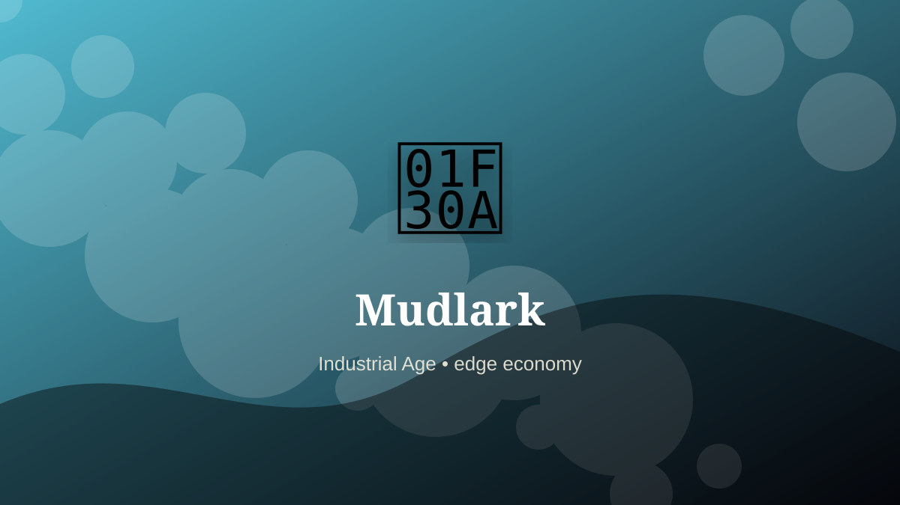

    ---
    title: "Mudlark"
    original_title: "Mudlark"
    era: "Industrial Age"
    era_key: "industrial"
    atlas_year_reference: "atlas anchor c. 1750–1950 CE"
    type: "weird"
    shelf: "marginal"
    evidence: "documented"
    representative_occurrence: "London and other river contexts"
    source_title: "Country Life: obsolete occupations from dog whippers to mudlarks"
    source_url: "https://www.countrylife.co.uk/culture/what-happened-to-bottom-knockers-canine-bothering-dog-whippers-and-grime-caked-mudlarks"
    image: "../assets/images/091-mudlark.svg"
    ---

    # Mudlark

    

    **Era:** Industrial Age  
    **Atlas year reference:** atlas anchor c. 1750–1950 CE  
    **Type:** weird  
    **Evidence status:** documented  
    **Shelf:** marginal  
    **Representative occurrence:** London and other river contexts

    ## Accuracy boundary

    Historically attested role or closely attested work pattern. The wording avoids pretending every region used the same job title or routine.

    ## Rewritten card

    This card is best read as a piece of infrastructure, not as a quaint job title. Mudlark handled the matter, hours, or spaces that more prestigious systems preferred not to face directly. Mudlarks searched riverbanks at low tide for coal, rope, metal, and saleable fragments.

The work was necessary because settlements, markets, armies, workshops, and households produce residue. Why it mattered: The river redistributed the city’s leftovers.

This is hidden labor. It becomes visible only when it fails, when it smells, when it blocks movement, when disease spreads, or when a cleaner system has not yet been built. Modern echo: Mudlarking survives partly as licensed historical recovery and hobby practice.

Representative occurrence: London and other river contexts

Modern echo: shoreline recovery

Reference lead: Country Life: obsolete occupations from dog whippers to mudlarks — https://www.countrylife.co.uk/culture/what-happened-to-bottom-knockers-canine-bothering-dog-whippers-and-grime-caked-mudlarks

    ## Image guidance

    The included SVG is a local placeholder for offline viewing. For a final public atlas, replace it with a documented image where possible: museum object photo, archaeological reconstruction, historical illustration, workplace photograph, or clearly labeled concept art for speculative cards.

    ## Source lead

    - Country Life: obsolete occupations from dog whippers to mudlarks: https://www.countrylife.co.uk/culture/what-happened-to-bottom-knockers-canine-bothering-dog-whippers-and-grime-caked-mudlarks
