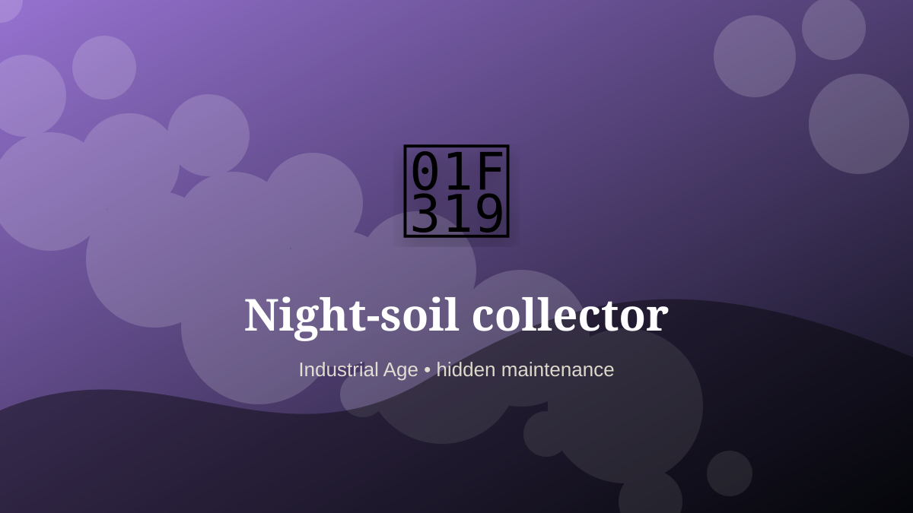

    ---
    title: "Night-soil collector"
    original_title: "Night-soil collector"
    era: "Industrial Age"
    era_key: "industrial"
    atlas_year_reference: "atlas anchor c. 1750–1950 CE"
    type: "weird"
    shelf: "filth"
    evidence: "documented"
    representative_occurrence: "many cities"
    source_title: "Newcastle Castle: Gong farmer"
    source_url: "https://www.newcastlecastle.co.uk/castle-blog/gong-farmer"
    image: "../assets/images/093-night-soil-collector.svg"
    ---

    # Night-soil collector

    

    **Era:** Industrial Age  
    **Atlas year reference:** atlas anchor c. 1750–1950 CE  
    **Type:** weird  
    **Evidence status:** documented  
    **Shelf:** filth  
    **Representative occurrence:** many cities

    ## Accuracy boundary

    Historically attested role or closely attested work pattern. The wording avoids pretending every region used the same job title or routine.

    ## Rewritten card

    The important fact is not only what the worker made, but what became possible because the work was reliable. Night-soil collector handled the matter, hours, or spaces that more prestigious systems preferred not to face directly. Collecting human waste for removal or agricultural reuse continued into industrializing cities before sewer networks displaced much of the work.

The work was necessary because settlements, markets, armies, workshops, and households produce residue. Why it mattered: Urban metabolism needed an exit route.

This is hidden labor. It becomes visible only when it fails, when it smells, when it blocks movement, when disease spreads, or when a cleaner system has not yet been built. Modern echo: Wastewater treatment formalizes the same substrate flow.

Representative occurrence: many cities

Modern echo: sanitation logistics

Reference lead: Newcastle Castle: Gong farmer — https://www.newcastlecastle.co.uk/castle-blog/gong-farmer

    ## Image guidance

    The included SVG is a local placeholder for offline viewing. For a final public atlas, replace it with a documented image where possible: museum object photo, archaeological reconstruction, historical illustration, workplace photograph, or clearly labeled concept art for speculative cards.

    ## Source lead

    - Newcastle Castle: Gong farmer: https://www.newcastlecastle.co.uk/castle-blog/gong-farmer
