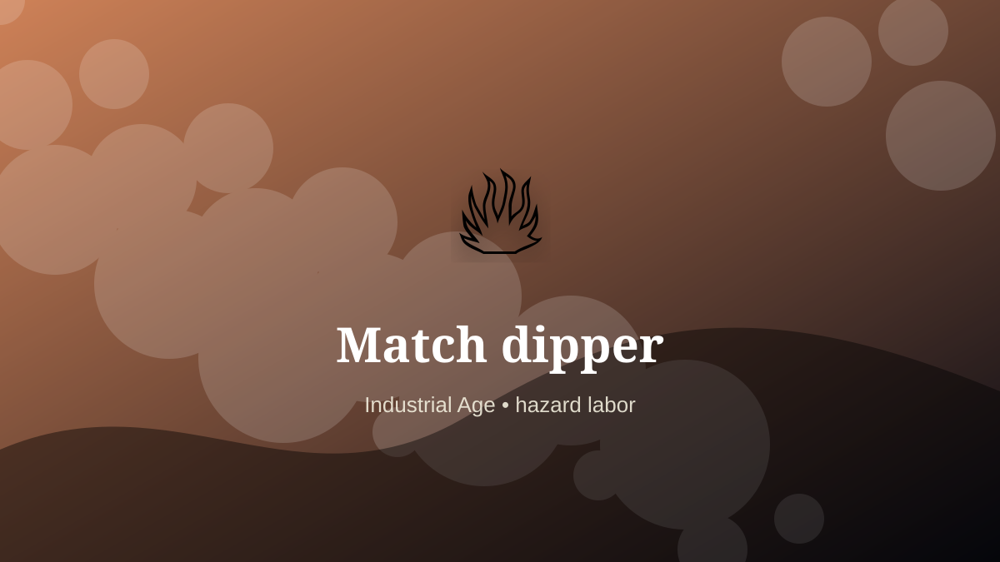

    ---
    title: "Match dipper"
    original_title: "Match dipper"
    era: "Industrial Age"
    era_key: "industrial"
    atlas_year_reference: "atlas anchor c. 1750–1950 CE"
    type: "weird"
    shelf: "danger"
    evidence: "documented"
    representative_occurrence: "industrial factories"
    source_title: "Science History Institute: occupational medicine and toxic work"
    source_url: "https://www.sciencehistory.org/stories/distillations-pod/the-alchemical-origins-of-occupational-medicine/"
    image: "../assets/images/094-match-dipper.svg"
    ---

    # Match dipper

    

    **Era:** Industrial Age  
    **Atlas year reference:** atlas anchor c. 1750–1950 CE  
    **Type:** weird  
    **Evidence status:** documented  
    **Shelf:** danger  
    **Representative occurrence:** industrial factories

    ## Accuracy boundary

    Historically attested role or closely attested work pattern. The wording avoids pretending every region used the same job title or routine.

    ## Rewritten card

    Match dipper required skill under bodily risk. Match workers handled hazardous compounds while producing cheap ignition at industrial scale.

The worker operated near injury, exposure, contamination, misclassification, pain, or irreversible change. Why it matters: Convenience can hide concentrated occupational risk.

The value of the work came from judgment under conditions where a mistake could not always be undone. Modern echo: Chemical safety standards are part of product design.

Representative occurrence: industrial factories

Modern echo: occupational safety

Reference lead: Science History Institute: occupational medicine and toxic work — https://www.sciencehistory.org/stories/distillations-pod/the-alchemical-origins-of-occupational-medicine/

    ## Image guidance

    The included SVG is a local placeholder for offline viewing. For a final public atlas, replace it with a documented image where possible: museum object photo, archaeological reconstruction, historical illustration, workplace photograph, or clearly labeled concept art for speculative cards.

    ## Source lead

    - Science History Institute: occupational medicine and toxic work: https://www.sciencehistory.org/stories/distillations-pod/the-alchemical-origins-of-occupational-medicine/
