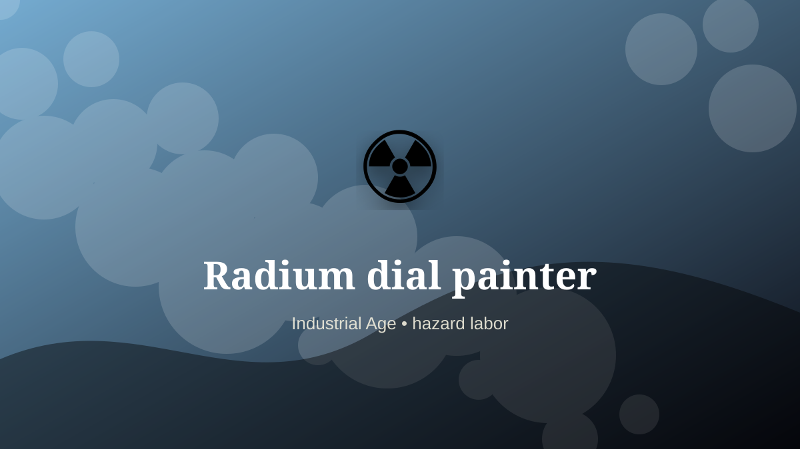

    ---
    title: "Radium dial painter"
    original_title: "Radium dial painter"
    era: "Industrial Age"
    era_key: "industrial"
    atlas_year_reference: "atlas anchor c. 1750–1950 CE"
    type: "weird"
    shelf: "danger"
    evidence: "documented"
    representative_occurrence: "20th-century factories"
    source_title: "Science History Institute: occupational medicine and toxic work"
    source_url: "https://www.sciencehistory.org/stories/distillations-pod/the-alchemical-origins-of-occupational-medicine/"
    image: "../assets/images/095-radium-dial-painter.svg"
    ---

    # Radium dial painter

    

    **Era:** Industrial Age  
    **Atlas year reference:** atlas anchor c. 1750–1950 CE  
    **Type:** weird  
    **Evidence status:** documented  
    **Shelf:** danger  
    **Representative occurrence:** 20th-century factories

    ## Accuracy boundary

    Historically attested role or closely attested work pattern. The wording avoids pretending every region used the same job title or routine.

    ## Rewritten card

    Radium dial painter required skill under bodily risk. Workers painted luminous watch and instrument dials with radium-based pigment. Fine brush practices could intensify exposure.

The worker operated near injury, exposure, contamination, misclassification, pain, or irreversible change. Why it matters: Aesthetic precision became a toxic pathway.

The value of the work came from judgment under conditions where a mistake could not always be undone. Modern echo: Invisible hazards require governance, not intuition.

Representative occurrence: 20th-century factories

Modern echo: radiological safety

Reference lead: Science History Institute: occupational medicine and toxic work — https://www.sciencehistory.org/stories/distillations-pod/the-alchemical-origins-of-occupational-medicine/

    ## Image guidance

    The included SVG is a local placeholder for offline viewing. For a final public atlas, replace it with a documented image where possible: museum object photo, archaeological reconstruction, historical illustration, workplace photograph, or clearly labeled concept art for speculative cards.

    ## Source lead

    - Science History Institute: occupational medicine and toxic work: https://www.sciencehistory.org/stories/distillations-pod/the-alchemical-origins-of-occupational-medicine/
