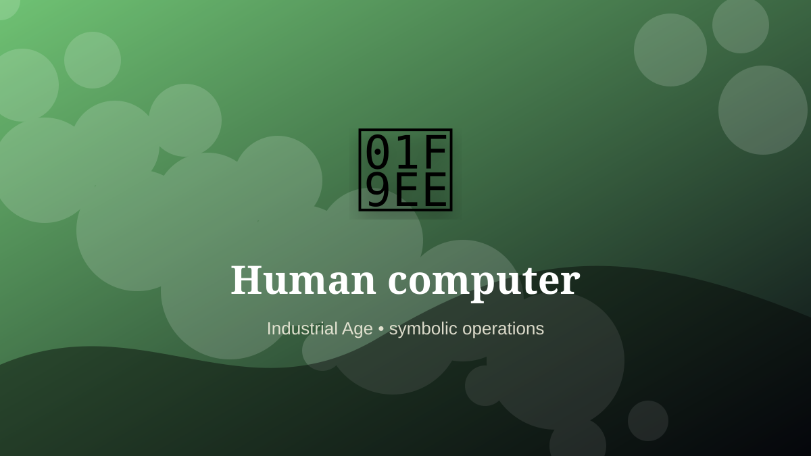

    ---
    title: "Human computer"
    original_title: "Human computer"
    era: "Industrial Age"
    era_key: "industrial"
    atlas_year_reference: "atlas anchor c. 1750–1950 CE"
    type: "weird"
    shelf: "proto-code"
    evidence: "documented"
    representative_occurrence: "research and engineering institutions"
    source_title: "Smithsonian Human Origins: introduction to human evolution"
    source_url: "https://humanorigins.si.edu/education/introduction-human-evolution"
    image: "../assets/images/100-human-computer.svg"
    ---

    # Human computer

    

    **Era:** Industrial Age  
    **Atlas year reference:** atlas anchor c. 1750–1950 CE  
    **Type:** weird  
    **Evidence status:** documented  
    **Shelf:** proto-code  
    **Representative occurrence:** research and engineering institutions

    ## Accuracy boundary

    Historically attested role or closely attested work pattern. The wording avoids pretending every region used the same job title or routine.

    ## Rewritten card

    Human computer converted human activity into a controlled representation. Before electronic computers, people carried out repetitive calculations for astronomy, navigation, engineering, and research.

That representation might be a record, calculation, label, signal, interface, performance, or shared attention structure. Why it mattered: Computation was a labor category before it was a machine category.

The craft matters because downstream systems trust the encoded result. A small error can travel farther than the worker ever does. Odd edge: Software begins as organized human procedure.

Representative occurrence: research and engineering institutions

Modern echo: software operations

Reference lead: Smithsonian Human Origins: introduction to human evolution — https://humanorigins.si.edu/education/introduction-human-evolution

    ## Image guidance

    The included SVG is a local placeholder for offline viewing. For a final public atlas, replace it with a documented image where possible: museum object photo, archaeological reconstruction, historical illustration, workplace photograph, or clearly labeled concept art for speculative cards.

    ## Source lead

    - Smithsonian Human Origins: introduction to human evolution: https://humanorigins.si.edu/education/introduction-human-evolution
