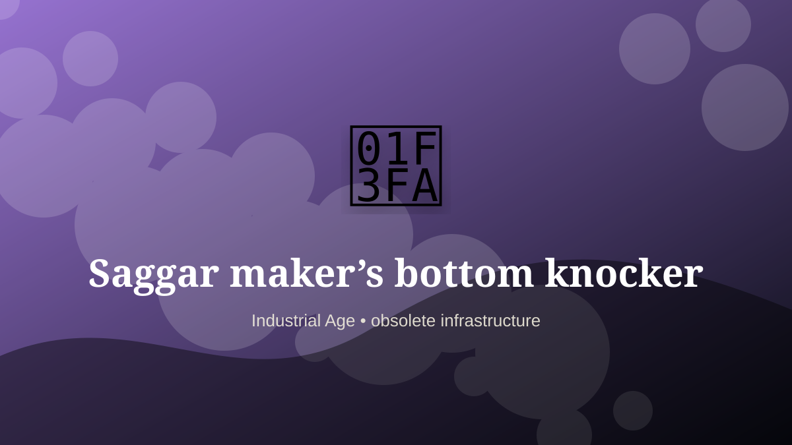

    ---
    title: "Saggar maker’s bottom knocker"
    original_title: "Saggar maker’s bottom knocker"
    era: "Industrial Age"
    era_key: "industrial"
    atlas_year_reference: "atlas anchor c. 1750–1950 CE"
    type: "weird"
    shelf: "obsolete"
    evidence: "documented"
    representative_occurrence: "British ceramics industry"
    source_title: "Country Life: obsolete occupations from dog whippers to mudlarks"
    source_url: "https://www.countrylife.co.uk/culture/what-happened-to-bottom-knockers-canine-bothering-dog-whippers-and-grime-caked-mudlarks"
    image: "../assets/images/101-saggar-maker-s-bottom-knocker.svg"
    ---

    # Saggar maker’s bottom knocker

    

    **Era:** Industrial Age  
    **Atlas year reference:** atlas anchor c. 1750–1950 CE  
    **Type:** weird  
    **Evidence status:** documented  
    **Shelf:** obsolete  
    **Representative occurrence:** British ceramics industry

    ## Accuracy boundary

    Historically attested role or closely attested work pattern. The wording avoids pretending every region used the same job title or routine.

    ## Rewritten card

    This card is best read as a piece of infrastructure, not as a quaint job title. Saggar maker’s bottom knocker was a practical specialist within the Industrial Age. In pottery production, this unusually named role prepared clay discs for protective kiln containers called saggars.

The craft mattered because it stabilized another activity: food, shelter, mobility, trade, recordkeeping, power, repair, or symbolic continuity. Why it feels strange: Extreme specialization can produce surreal job titles.

The deeper lesson is that ordinary tools often hide extraordinary dependencies. Modern echo: Factories fragment craft into narrow repeatable stations.

Representative occurrence: British ceramics industry

Modern echo: manufacturing specialization

Reference lead: Country Life: obsolete occupations from dog whippers to mudlarks — https://www.countrylife.co.uk/culture/what-happened-to-bottom-knockers-canine-bothering-dog-whippers-and-grime-caked-mudlarks

    ## Image guidance

    The included SVG is a local placeholder for offline viewing. For a final public atlas, replace it with a documented image where possible: museum object photo, archaeological reconstruction, historical illustration, workplace photograph, or clearly labeled concept art for speculative cards.

    ## Source lead

    - Country Life: obsolete occupations from dog whippers to mudlarks: https://www.countrylife.co.uk/culture/what-happened-to-bottom-knockers-canine-bothering-dog-whippers-and-grime-caked-mudlarks
