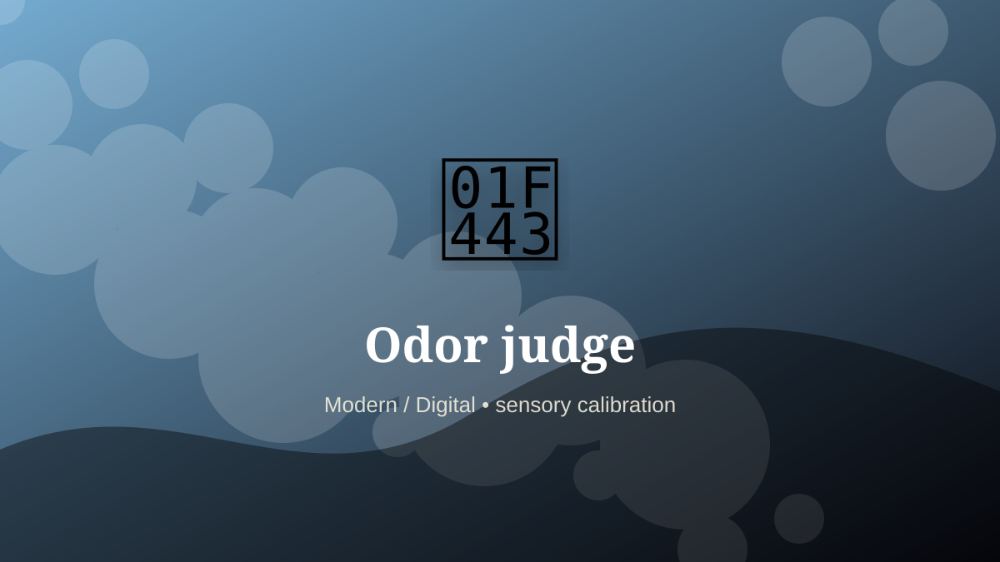

    ---
    title: "Odor judge"
    original_title: "Odor judge"
    era: "Modern / Digital"
    era_key: "modern"
    atlas_year_reference: "atlas lens c. 1950 CE–present"
    type: "weird"
    shelf: "sensory"
    evidence: "documented"
    representative_occurrence: "consumer and environmental testing"
    source_title: "Science History Institute: occupational medicine and toxic work"
    source_url: "https://www.sciencehistory.org/stories/distillations-pod/the-alchemical-origins-of-occupational-medicine/"
    image: "../assets/images/103-odor-judge.svg"
    ---

    # Odor judge

    

    **Era:** Modern / Digital  
    **Atlas year reference:** atlas lens c. 1950 CE–present  
    **Type:** weird  
    **Evidence status:** documented  
    **Shelf:** sensory  
    **Representative occurrence:** consumer and environmental testing

    ## Accuracy boundary

    Historically attested role or closely attested work pattern. The wording avoids pretending every region used the same job title or routine.

    ## Rewritten card

    Odor judge turned perception into craft. Some industries use trained evaluators to assess odor intensity, persistence, or product performance.

The role depended on trained discrimination: color, sound, smell, texture, proportion, taste, surface, rhythm, or minute visual difference. Why it matters: Not every quality signal is easy to instrument.

Its unusual lesson is that a society often stores value in details too small or too subtle for an untrained observer to notice. Odd edge: A nose becomes calibrated equipment.

Representative occurrence: consumer and environmental testing

Modern echo: sensor calibration

Reference lead: Science History Institute: occupational medicine and toxic work — https://www.sciencehistory.org/stories/distillations-pod/the-alchemical-origins-of-occupational-medicine/

    ## Image guidance

    The included SVG is a local placeholder for offline viewing. For a final public atlas, replace it with a documented image where possible: museum object photo, archaeological reconstruction, historical illustration, workplace photograph, or clearly labeled concept art for speculative cards.

    ## Source lead

    - Science History Institute: occupational medicine and toxic work: https://www.sciencehistory.org/stories/distillations-pod/the-alchemical-origins-of-occupational-medicine/
