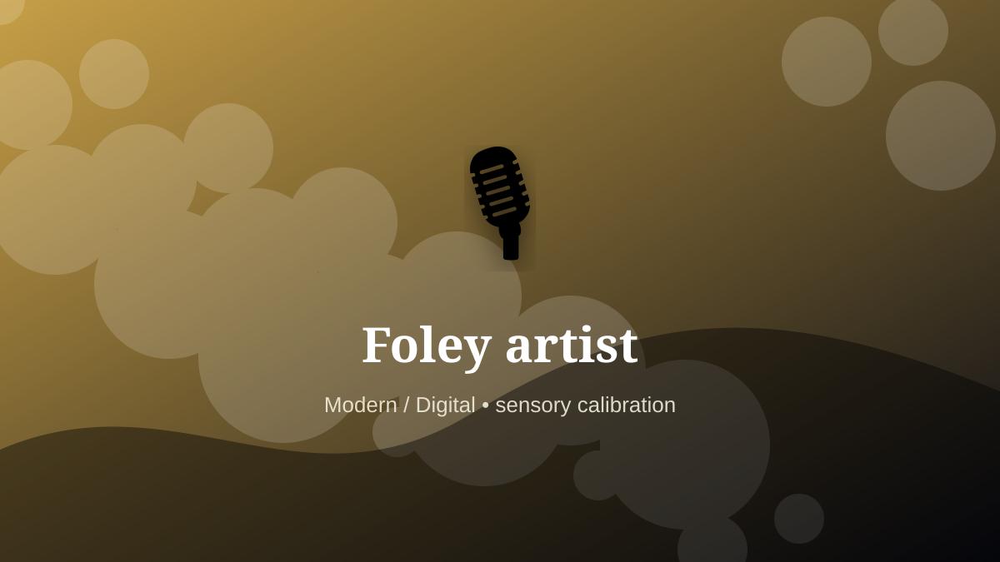

    ---
    title: "Foley artist"
    original_title: "Foley artist"
    era: "Modern / Digital"
    era_key: "modern"
    atlas_year_reference: "atlas lens c. 1950 CE–present"
    type: "weird"
    shelf: "sensory"
    evidence: "documented"
    representative_occurrence: "film and media production"
    source_title: "Smithsonian Human Origins: introduction to human evolution"
    source_url: "https://humanorigins.si.edu/education/introduction-human-evolution"
    image: "../assets/images/105-foley-artist.svg"
    ---

    # Foley artist

    

    **Era:** Modern / Digital  
    **Atlas year reference:** atlas lens c. 1950 CE–present  
    **Type:** weird  
    **Evidence status:** documented  
    **Shelf:** sensory  
    **Representative occurrence:** film and media production

    ## Accuracy boundary

    Historically attested role or closely attested work pattern. The wording avoids pretending every region used the same job title or routine.

    ## Rewritten card

    Foley artist turned perception into craft. Creating synchronized footsteps, cloth movement, impacts, and environmental sounds makes recorded images feel physically credible.

The role depended on trained discrimination: color, sound, smell, texture, proportion, taste, surface, rhythm, or minute visual difference. Why it matters: Reality on screen is partly handcrafted.

Its unusual lesson is that a society often stores value in details too small or too subtle for an untrained observer to notice. Odd edge: A cabbage can impersonate a body.

Representative occurrence: film and media production

Modern echo: synthetic sensory design

Reference lead: Smithsonian Human Origins: introduction to human evolution — https://humanorigins.si.edu/education/introduction-human-evolution

    ## Image guidance

    The included SVG is a local placeholder for offline viewing. For a final public atlas, replace it with a documented image where possible: museum object photo, archaeological reconstruction, historical illustration, workplace photograph, or clearly labeled concept art for speculative cards.

    ## Source lead

    - Smithsonian Human Origins: introduction to human evolution: https://humanorigins.si.edu/education/introduction-human-evolution
