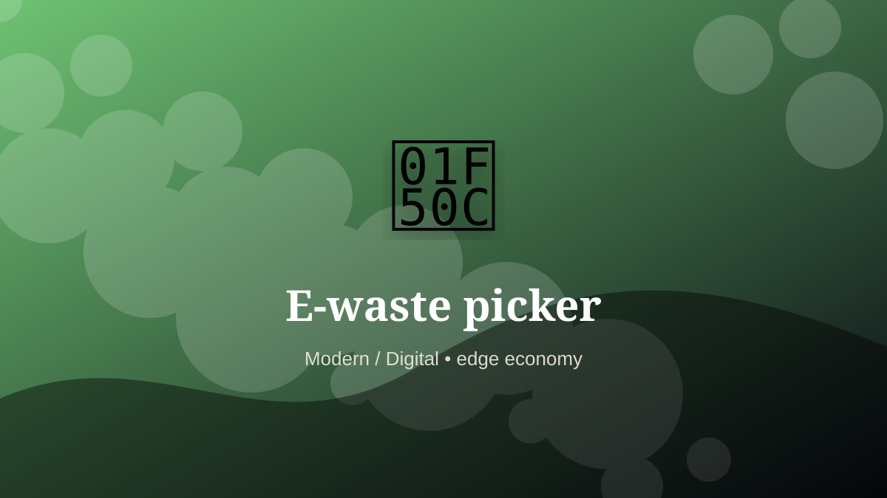

    ---
    title: "E-waste picker"
    original_title: "E-waste picker"
    era: "Modern / Digital"
    era_key: "modern"
    atlas_year_reference: "atlas lens c. 1950 CE–present"
    type: "weird"
    shelf: "marginal"
    evidence: "documented"
    representative_occurrence: "global e-waste streams"
    source_title: "Science History Institute: occupational medicine and toxic work"
    source_url: "https://www.sciencehistory.org/stories/distillations-pod/the-alchemical-origins-of-occupational-medicine/"
    image: "../assets/images/108-e-waste-picker.svg"
    ---

    # E-waste picker

    

    **Era:** Modern / Digital  
    **Atlas year reference:** atlas lens c. 1950 CE–present  
    **Type:** weird  
    **Evidence status:** documented  
    **Shelf:** marginal  
    **Representative occurrence:** global e-waste streams

    ## Accuracy boundary

    Historically attested role or closely attested work pattern. The wording avoids pretending every region used the same job title or routine.

    ## Rewritten card

    The important fact is not only what the worker made, but what became possible because the work was reliable. E-waste picker handled the matter, hours, or spaces that more prestigious systems preferred not to face directly. Sorting discarded electronics for reusable parts and recoverable metals sits at the hazardous edge of the device economy.

The work was necessary because settlements, markets, armies, workshops, and households produce residue. Why it matters: The digital world has a material afterlife.

This is hidden labor. It becomes visible only when it fails, when it smells, when it blocks movement, when disease spreads, or when a cleaner system has not yet been built. Modern echo: Circular electronics design remains incomplete.

Representative occurrence: global e-waste streams

Modern echo: urban mining

Reference lead: Science History Institute: occupational medicine and toxic work — https://www.sciencehistory.org/stories/distillations-pod/the-alchemical-origins-of-occupational-medicine/

    ## Image guidance

    The included SVG is a local placeholder for offline viewing. For a final public atlas, replace it with a documented image where possible: museum object photo, archaeological reconstruction, historical illustration, workplace photograph, or clearly labeled concept art for speculative cards.

    ## Source lead

    - Science History Institute: occupational medicine and toxic work: https://www.sciencehistory.org/stories/distillations-pod/the-alchemical-origins-of-occupational-medicine/
