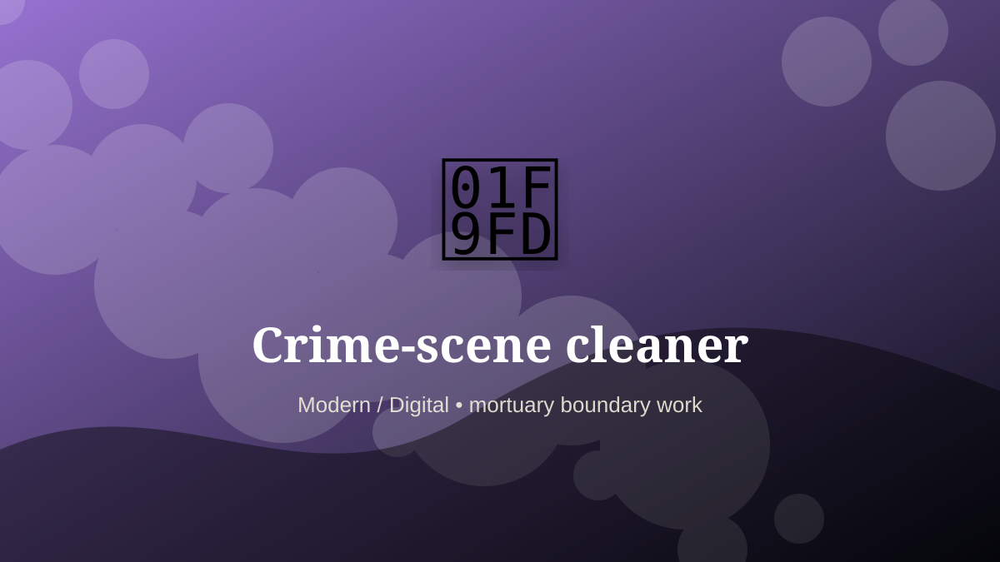

    ---
    title: "Crime-scene cleaner"
    original_title: "Crime-scene cleaner"
    era: "Modern / Digital"
    era_key: "modern"
    atlas_year_reference: "atlas lens c. 1950 CE–present"
    type: "weird"
    shelf: "death"
    evidence: "documented"
    representative_occurrence: "modern service systems"
    source_title: "Science History Institute: occupational medicine and toxic work"
    source_url: "https://www.sciencehistory.org/stories/distillations-pod/the-alchemical-origins-of-occupational-medicine/"
    image: "../assets/images/109-crime-scene-cleaner.svg"
    ---

    # Crime-scene cleaner

    

    **Era:** Modern / Digital  
    **Atlas year reference:** atlas lens c. 1950 CE–present  
    **Type:** weird  
    **Evidence status:** documented  
    **Shelf:** death  
    **Representative occurrence:** modern service systems

    ## Accuracy boundary

    Historically attested role or closely attested work pattern. The wording avoids pretending every region used the same job title or routine.

    ## Rewritten card

    Crime-scene cleaner sits where technique and legitimacy touch. Restoring spaces after investigations or traumatic events requires decontamination discipline, discretion, and emotional steadiness.

In the Modern / Digital, work like this cannot be separated cleanly from belief, law, memory, rank, or public trust. The craft mattered because it produced an outcome other people were willing to recognize as valid. Why it matters: A site must return from evidence-space to human-space.

The strange edge is this: Cleaning becomes transition work. The material act was only half the job. The other half was making the act socially legible.

Representative occurrence: modern service systems

Modern echo: remediation operations

Reference lead: Science History Institute: occupational medicine and toxic work — https://www.sciencehistory.org/stories/distillations-pod/the-alchemical-origins-of-occupational-medicine/

    ## Image guidance

    The included SVG is a local placeholder for offline viewing. For a final public atlas, replace it with a documented image where possible: museum object photo, archaeological reconstruction, historical illustration, workplace photograph, or clearly labeled concept art for speculative cards.

    ## Source lead

    - Science History Institute: occupational medicine and toxic work: https://www.sciencehistory.org/stories/distillations-pod/the-alchemical-origins-of-occupational-medicine/
