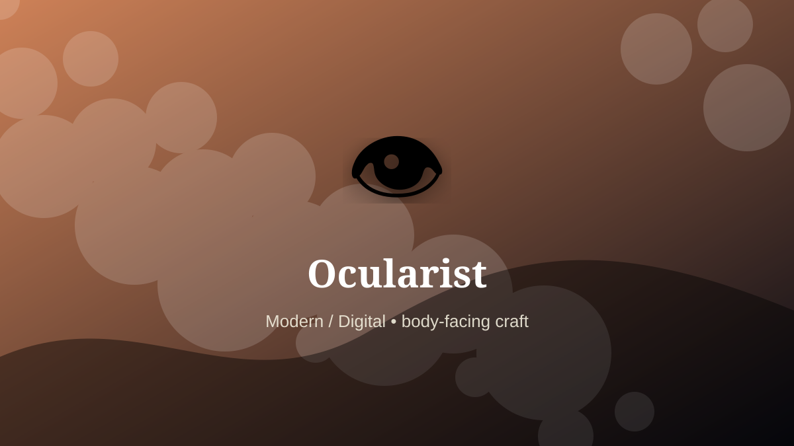

    ---
    title: "Ocularist"
    original_title: "Ocularist"
    era: "Modern / Digital"
    era_key: "modern"
    atlas_year_reference: "atlas lens c. 1950 CE–present"
    type: "mainstream"
    shelf: "body"
    evidence: "documented"
    representative_occurrence: "modern clinical systems"
    source_title: "Wellcome Collection text archive: historical medicine context"
    source_url: "https://api.wellcomecollection.org/text/v1/b21443348"
    image: "../assets/images/110-ocularist.svg"
    ---

    # Ocularist

    

    **Era:** Modern / Digital  
    **Atlas year reference:** atlas lens c. 1950 CE–present  
    **Type:** mainstream  
    **Evidence status:** documented  
    **Shelf:** body  
    **Representative occurrence:** modern clinical systems

    ## Accuracy boundary

    Historically attested role or closely attested work pattern. The wording avoids pretending every region used the same job title or routine.

    ## Rewritten card

    Ocularist required skill under bodily risk. Creating and fitting ocular prostheses combines anatomy, color matching, sculpture, and patient-specific adjustment.

The worker operated near injury, exposure, contamination, misclassification, pain, or irreversible change. Why it mattered: Medical function and identity meet at millimeter scale.

The value of the work came from judgment under conditions where a mistake could not always be undone. Odd edge: A tiny painted surface can restore social ease.

Representative occurrence: modern clinical systems

Modern echo: medical prosthetics

Reference lead: Wellcome Collection text archive: historical medicine context — https://api.wellcomecollection.org/text/v1/b21443348

    ## Image guidance

    The included SVG is a local placeholder for offline viewing. For a final public atlas, replace it with a documented image where possible: museum object photo, archaeological reconstruction, historical illustration, workplace photograph, or clearly labeled concept art for speculative cards.

    ## Source lead

    - Wellcome Collection text archive: historical medicine context: https://api.wellcomecollection.org/text/v1/b21443348
