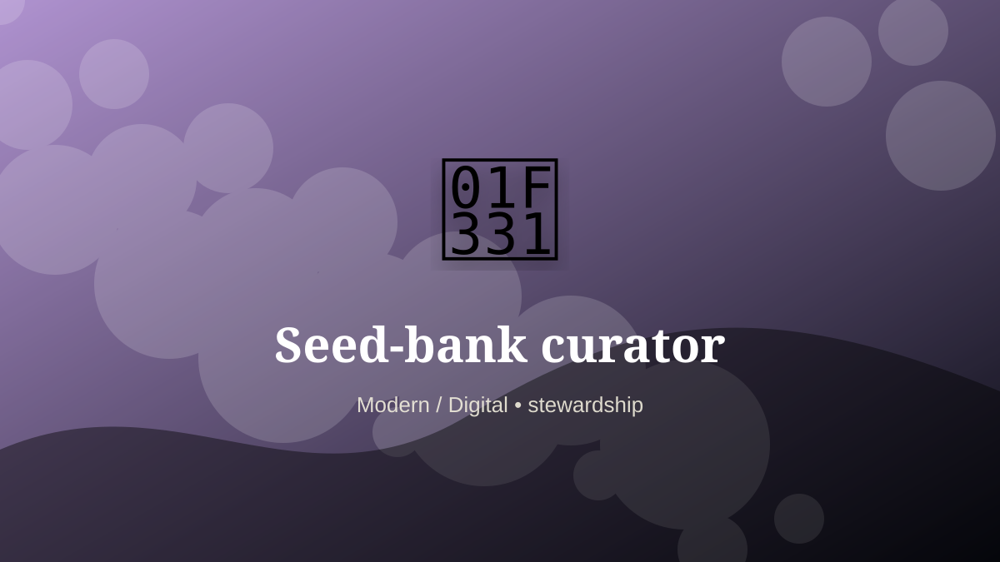

    ---
    title: "Seed-bank curator"
    original_title: "Seed-bank curator"
    era: "Modern / Digital"
    era_key: "modern"
    atlas_year_reference: "atlas lens c. 1950 CE–present"
    type: "mainstream"
    shelf: "archive"
    evidence: "documented"
    representative_occurrence: "global conservation networks"
    source_title: "Smithsonian Human Origins: introduction to human evolution"
    source_url: "https://humanorigins.si.edu/education/introduction-human-evolution"
    image: "../assets/images/112-seed-bank-curator.svg"
    ---

    # Seed-bank curator

    

    **Era:** Modern / Digital  
    **Atlas year reference:** atlas lens c. 1950 CE–present  
    **Type:** mainstream  
    **Evidence status:** documented  
    **Shelf:** archive  
    **Representative occurrence:** global conservation networks

    ## Accuracy boundary

    Historically attested role or closely attested work pattern. The wording avoids pretending every region used the same job title or routine.

    ## Rewritten card

    Seed-bank curator converted human activity into a controlled representation. Collecting, documenting, storing, and periodically testing seeds preserves options for future agriculture and ecological recovery.

That representation might be a record, calculation, label, signal, interface, performance, or shared attention structure. Why it matters: A collection can be a resilience system.

The craft matters because downstream systems trust the encoded result. A small error can travel farther than the worker ever does. Odd edge: Dormancy becomes infrastructure.

Representative occurrence: global conservation networks

Modern echo: biodiversity stewardship

Reference lead: Smithsonian Human Origins: introduction to human evolution — https://humanorigins.si.edu/education/introduction-human-evolution

    ## Image guidance

    The included SVG is a local placeholder for offline viewing. For a final public atlas, replace it with a documented image where possible: museum object photo, archaeological reconstruction, historical illustration, workplace photograph, or clearly labeled concept art for speculative cards.

    ## Source lead

    - Smithsonian Human Origins: introduction to human evolution: https://humanorigins.si.edu/education/introduction-human-evolution
