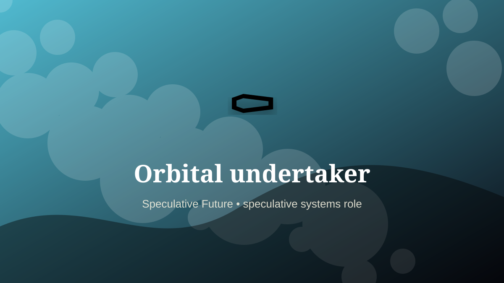

    ---
    title: "Orbital undertaker"
    original_title: "Orbital undertaker"
    era: "Speculative Future"
    era_key: "future"
    atlas_year_reference: "speculative near future+"
    type: "weird"
    shelf: "speculative"
    evidence: "speculative"
    representative_occurrence: "off-world settlements"
    source_title: "Smithsonian Human Origins: introduction to human evolution"
    source_url: "https://humanorigins.si.edu/education/introduction-human-evolution"
    image: "../assets/images/115-orbital-undertaker.svg"
    ---

    # Orbital undertaker

    

    **Era:** Speculative Future  
    **Atlas year reference:** speculative near future+  
    **Type:** weird  
    **Evidence status:** speculative  
    **Shelf:** speculative  
    **Representative occurrence:** off-world settlements

    ## Accuracy boundary

    Speculative future role. Included as a designed extrapolation, not as an established occupation.

    ## Rewritten card

    Orbital undertaker is a speculative systems role, not a settled occupation. Speculative trade: managing death protocols, remains, memorials, and family communication for off-world communities.

The reason to include it is that emerging infrastructure creates new responsibility gaps. Why it matters: Human settlement exports funerary logistics.

The craft would not merely be technical. It would require governance, auditability, escalation rules, and human judgment at the point where automation becomes ambiguous. Odd edge: Gravity changes ceremony.

This is explicitly a future-facing systems card, not a historical claim.

Representative occurrence: off-world settlements

Modern echo: space mortuary protocol

Reference lead: Smithsonian Human Origins: introduction to human evolution — https://humanorigins.si.edu/education/introduction-human-evolution

    ## Image guidance

    The included SVG is a local placeholder for offline viewing. For a final public atlas, replace it with a documented image where possible: museum object photo, archaeological reconstruction, historical illustration, workplace photograph, or clearly labeled concept art for speculative cards.

    ## Source lead

    - Smithsonian Human Origins: introduction to human evolution: https://humanorigins.si.edu/education/introduction-human-evolution
