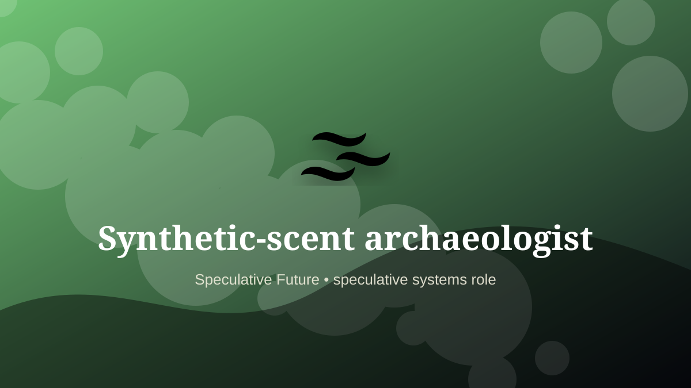

    ---
    title: "Synthetic-scent archaeologist"
    original_title: "Synthetic-scent archaeologist"
    era: "Speculative Future"
    era_key: "future"
    atlas_year_reference: "speculative near future+"
    type: "weird"
    shelf: "speculative"
    evidence: "speculative"
    representative_occurrence: "museums and immersive archives"
    source_title: "Smithsonian Human Origins: introduction to human evolution"
    source_url: "https://humanorigins.si.edu/education/introduction-human-evolution"
    image: "../assets/images/116-synthetic-scent-archaeologist.svg"
    ---

    # Synthetic-scent archaeologist

    

    **Era:** Speculative Future  
    **Atlas year reference:** speculative near future+  
    **Type:** weird  
    **Evidence status:** speculative  
    **Shelf:** speculative  
    **Representative occurrence:** museums and immersive archives

    ## Accuracy boundary

    Speculative future role. Included as a designed extrapolation, not as an established occupation.

    ## Rewritten card

    Synthetic-scent archaeologist is a speculative systems role, not a settled occupation. Speculative trade: reconstructing historic smells from chemical records, archives, environments, and material traces.

The reason to include it is that emerging infrastructure creates new responsibility gaps. Why it matters: History is not only visual.

The craft would not merely be technical. It would require governance, auditability, escalation rules, and human judgment at the point where automation becomes ambiguous. Odd edge: A vanished street can return as air.

This is explicitly a future-facing systems card, not a historical claim.

Representative occurrence: museums and immersive archives

Modern echo: sensory heritage

Reference lead: Smithsonian Human Origins: introduction to human evolution — https://humanorigins.si.edu/education/introduction-human-evolution

    ## Image guidance

    The included SVG is a local placeholder for offline viewing. For a final public atlas, replace it with a documented image where possible: museum object photo, archaeological reconstruction, historical illustration, workplace photograph, or clearly labeled concept art for speculative cards.

    ## Source lead

    - Smithsonian Human Origins: introduction to human evolution: https://humanorigins.si.edu/education/introduction-human-evolution
