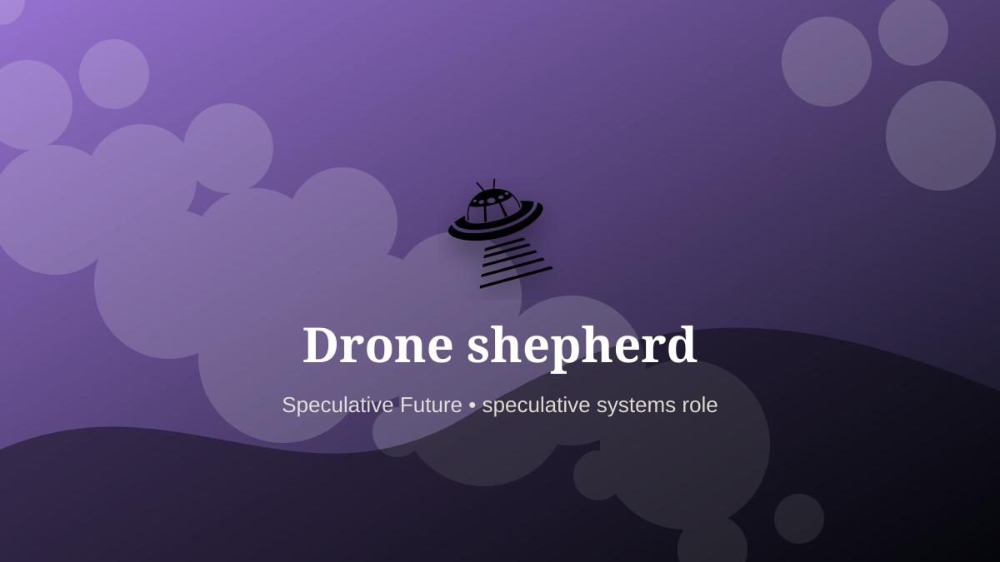

    ---
    title: "Drone shepherd"
    original_title: "Drone shepherd"
    era: "Speculative Future"
    era_key: "future"
    atlas_year_reference: "speculative near future+"
    type: "mainstream"
    shelf: "speculative"
    evidence: "speculative"
    representative_occurrence: "near future"
    source_title: "Smithsonian Human Origins: introduction to human evolution"
    source_url: "https://humanorigins.si.edu/education/introduction-human-evolution"
    image: "../assets/images/117-drone-shepherd.svg"
    ---

    # Drone shepherd

    

    **Era:** Speculative Future  
    **Atlas year reference:** speculative near future+  
    **Type:** mainstream  
    **Evidence status:** speculative  
    **Shelf:** speculative  
    **Representative occurrence:** near future

    ## Accuracy boundary

    Speculative future role. Included as a designed extrapolation, not as an established occupation.

    ## Rewritten card

    Drone shepherd is a speculative systems role, not a settled occupation. Supervising fleets of aerial or ground machines for farming, inspection, mapping, and emergency response.

The reason to include it is that emerging infrastructure creates new responsibility gaps. Why it matters: One worker may guide many moving tools.

The craft would not merely be technical. It would require governance, auditability, escalation rules, and human judgment at the point where automation becomes ambiguous. Odd edge: Herding shifts from animals to autonomy.

This is explicitly a future-facing systems card, not a historical claim.

Representative occurrence: near future

Modern echo: fleet operations

Reference lead: Smithsonian Human Origins: introduction to human evolution — https://humanorigins.si.edu/education/introduction-human-evolution

    ## Image guidance

    The included SVG is a local placeholder for offline viewing. For a final public atlas, replace it with a documented image where possible: museum object photo, archaeological reconstruction, historical illustration, workplace photograph, or clearly labeled concept art for speculative cards.

    ## Source lead

    - Smithsonian Human Origins: introduction to human evolution: https://humanorigins.si.edu/education/introduction-human-evolution
