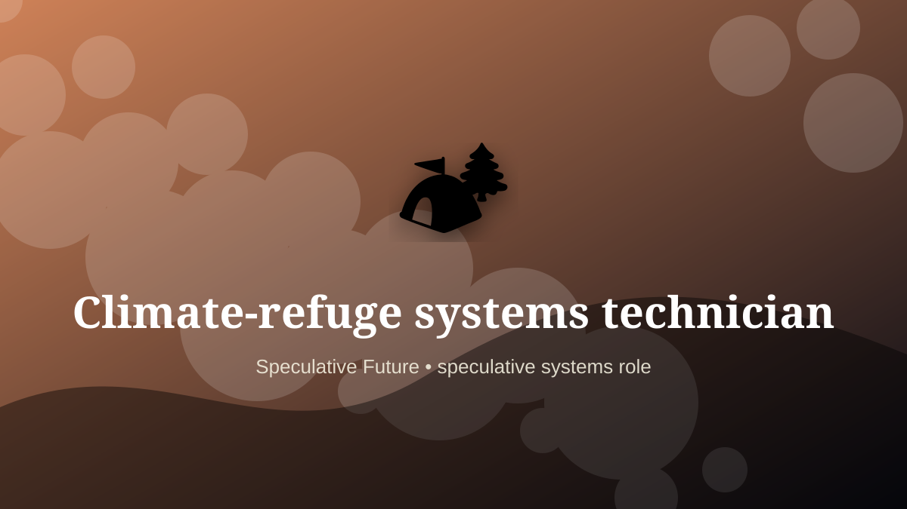

    ---
    title: "Climate-refuge systems technician"
    original_title: "Climate-refuge systems technician"
    era: "Speculative Future"
    era_key: "future"
    atlas_year_reference: "speculative near future+"
    type: "mainstream"
    shelf: "speculative"
    evidence: "speculative"
    representative_occurrence: "near future"
    source_title: "Smithsonian Human Origins: introduction to human evolution"
    source_url: "https://humanorigins.si.edu/education/introduction-human-evolution"
    image: "../assets/images/118-climate-refuge-systems-technician.svg"
    ---

    # Climate-refuge systems technician

    

    **Era:** Speculative Future  
    **Atlas year reference:** speculative near future+  
    **Type:** mainstream  
    **Evidence status:** speculative  
    **Shelf:** speculative  
    **Representative occurrence:** near future

    ## Accuracy boundary

    Speculative future role. Included as a designed extrapolation, not as an established occupation.

    ## Rewritten card

    Climate-refuge systems technician is a speculative systems role, not a settled occupation. Maintaining modular water, cooling, filtration, power, and sanitation systems for heat, smoke, flood, or displacement events.

The reason to include it is that emerging infrastructure creates new responsibility gaps. Why it matters: Habitability becomes an explicit technical service.

The craft would not merely be technical. It would require governance, auditability, escalation rules, and human judgment at the point where automation becomes ambiguous. Odd edge: Shelter returns as advanced infrastructure.

This is explicitly a future-facing systems card, not a historical claim.

Representative occurrence: near future

Modern echo: resilience operations

Reference lead: Smithsonian Human Origins: introduction to human evolution — https://humanorigins.si.edu/education/introduction-human-evolution

    ## Image guidance

    The included SVG is a local placeholder for offline viewing. For a final public atlas, replace it with a documented image where possible: museum object photo, archaeological reconstruction, historical illustration, workplace photograph, or clearly labeled concept art for speculative cards.

    ## Source lead

    - Smithsonian Human Origins: introduction to human evolution: https://humanorigins.si.edu/education/introduction-human-evolution
