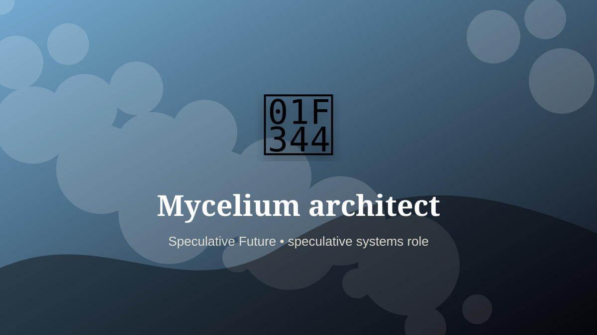

    ---
    title: "Mycelium architect"
    original_title: "Mycelium architect"
    era: "Speculative Future"
    era_key: "future"
    atlas_year_reference: "speculative near future+"
    type: "weird"
    shelf: "speculative"
    evidence: "speculative"
    representative_occurrence: "emerging and future fabrication"
    source_title: "Smithsonian Human Origins: introduction to human evolution"
    source_url: "https://humanorigins.si.edu/education/introduction-human-evolution"
    image: "../assets/images/119-mycelium-architect.svg"
    ---

    # Mycelium architect

    

    **Era:** Speculative Future  
    **Atlas year reference:** speculative near future+  
    **Type:** weird  
    **Evidence status:** speculative  
    **Shelf:** speculative  
    **Representative occurrence:** emerging and future fabrication

    ## Accuracy boundary

    Speculative future role. Included as a designed extrapolation, not as an established occupation.

    ## Rewritten card

    Mycelium architect is a speculative systems role, not a settled occupation. Designing forms and conditions for fungal composites turns construction into cultivation.

The reason to include it is that emerging infrastructure creates new responsibility gaps. Why it matters: Material fabrication may become guided growth.

The craft would not merely be technical. It would require governance, auditability, escalation rules, and human judgment at the point where automation becomes ambiguous. Odd edge: The workshop behaves more like a garden.

This is explicitly a future-facing systems card, not a historical claim.

Representative occurrence: emerging and future fabrication

Modern echo: bio-based construction

Reference lead: Smithsonian Human Origins: introduction to human evolution — https://humanorigins.si.edu/education/introduction-human-evolution

    ## Image guidance

    The included SVG is a local placeholder for offline viewing. For a final public atlas, replace it with a documented image where possible: museum object photo, archaeological reconstruction, historical illustration, workplace photograph, or clearly labeled concept art for speculative cards.

    ## Source lead

    - Smithsonian Human Origins: introduction to human evolution: https://humanorigins.si.edu/education/introduction-human-evolution
