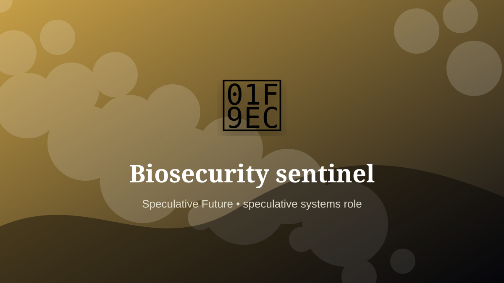

    ---
    title: "Biosecurity sentinel"
    original_title: "Biosecurity sentinel"
    era: "Speculative Future"
    era_key: "future"
    atlas_year_reference: "speculative near future+"
    type: "mainstream"
    shelf: "speculative"
    evidence: "speculative"
    representative_occurrence: "near future"
    source_title: "Smithsonian Human Origins: introduction to human evolution"
    source_url: "https://humanorigins.si.edu/education/introduction-human-evolution"
    image: "../assets/images/121-biosecurity-sentinel.svg"
    ---

    # Biosecurity sentinel

    

    **Era:** Speculative Future  
    **Atlas year reference:** speculative near future+  
    **Type:** mainstream  
    **Evidence status:** speculative  
    **Shelf:** speculative  
    **Representative occurrence:** near future

    ## Accuracy boundary

    Speculative future role. Included as a designed extrapolation, not as an established occupation.

    ## Rewritten card

    Biosecurity sentinel is a speculative systems role, not a settled occupation. Monitoring distributed biological signals and coordinating escalation across labs, hospitals, farms, and public systems.

The reason to include it is that emerging infrastructure creates new responsibility gaps. Why it matters: Detection only matters when ownership and response are clear.

The craft would not merely be technical. It would require governance, auditability, escalation rules, and human judgment at the point where automation becomes ambiguous. Odd edge: The craft is partly routing uncertainty.

This is explicitly a future-facing systems card, not a historical claim.

Representative occurrence: near future

Modern echo: public-health operations

Reference lead: Smithsonian Human Origins: introduction to human evolution — https://humanorigins.si.edu/education/introduction-human-evolution

    ## Image guidance

    The included SVG is a local placeholder for offline viewing. For a final public atlas, replace it with a documented image where possible: museum object photo, archaeological reconstruction, historical illustration, workplace photograph, or clearly labeled concept art for speculative cards.

    ## Source lead

    - Smithsonian Human Origins: introduction to human evolution: https://humanorigins.si.edu/education/introduction-human-evolution
